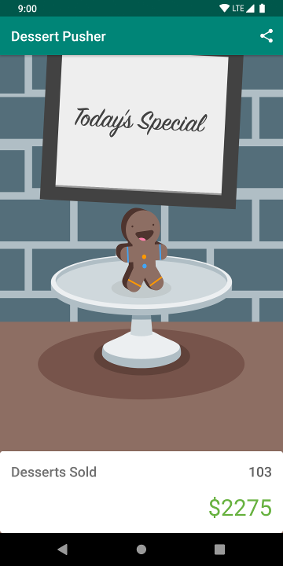

# Activity Lifecycle - DessertPusher 

This is the toy app for lesson 4 of the [Android App Development in Kotlin course on Udacity](https://www.udacity.com/course/developing-android-apps-with-kotlin--ud9012).

## DessertPusher

DessertPusher is a game about making desserts. Press the button, make a dessert, earn the big bucks.

This app is for exploring the [Activity Lifecycle callback methods](https://developer.android.com/guide/components/activities/activity-lifecycle) and the [Lifecycle](https://developer.android.com/reference/android/arch/lifecycle/Lifecycle) object.

## Screenshots

  

